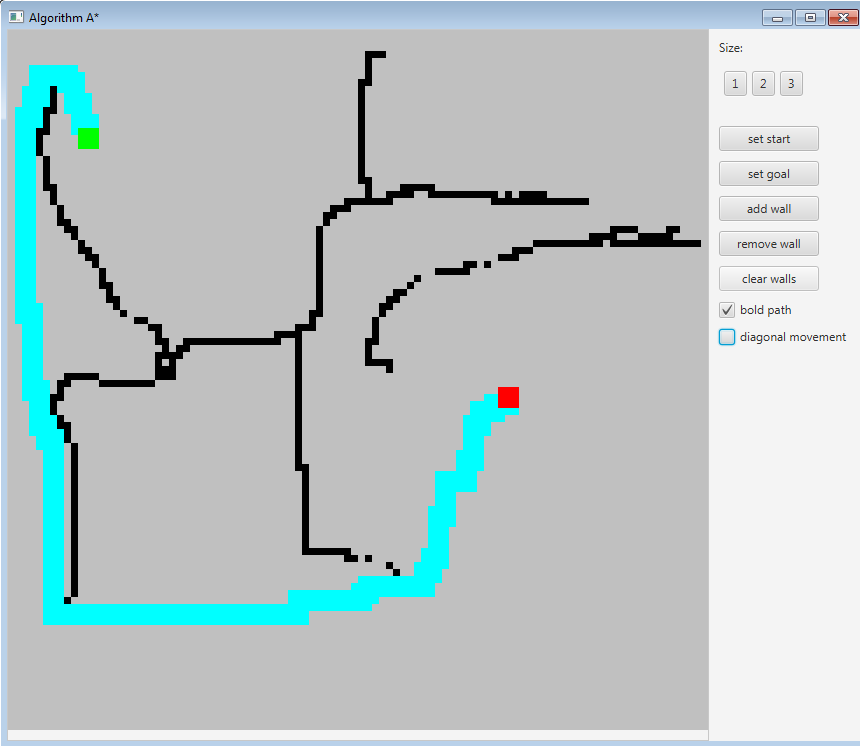

# Algorithm A* depending on object size

Algorithm A* implementation that takes in account size of an object.</br>
We have field 100x100 pixels, and object that can be either 1x1 px, 2x2 px or 3x3 px. </br>
File ExampleMain.java contains example of algorithm usage.</br>
See javadocs in code for more information.
Simple UI on JavaFX is used for visualization;</br>




### Built with Maven
##### Important:

**Java 8 is used, builds for Java 8 sometimes may not work on higher versions of java because of JavaFX.** </br>
**Cannot be built for java 7 and beyound, because it uses stream API and lambda expressions from Java 8.** </br>

Run `mvn package` or `mvn package -DskipTests`(in case tests failure) inside `algorithm_a` directory to build the project </br>

`algorithm-a-jar-with-dependencies.jar` will appear in `target` directory

run program:

```
      java -jar algorithm-a-jar-with-dependencies.jar
```

#### UI buttons:
- `Size` - set object size
- `Set start` - place start point on field
- `Set goal` - place goal point on field
- `add wall` - click to add walls on a field, then click on field
- `remove wall` - click to remove wall, then click on a wall to remove it
- `clear walls` - remove all walls from field

- `diagonal movement checkbox` - allow diagonal movement if checked
- `bold path checkbox` - path of the whole objects will be displayed if checked, otherwise
 it displays only path of it's central point (of upper left point if object is 2x2)

Path between start point and goal point will be displayed immediately
Path is redrawn every time the field is updated.